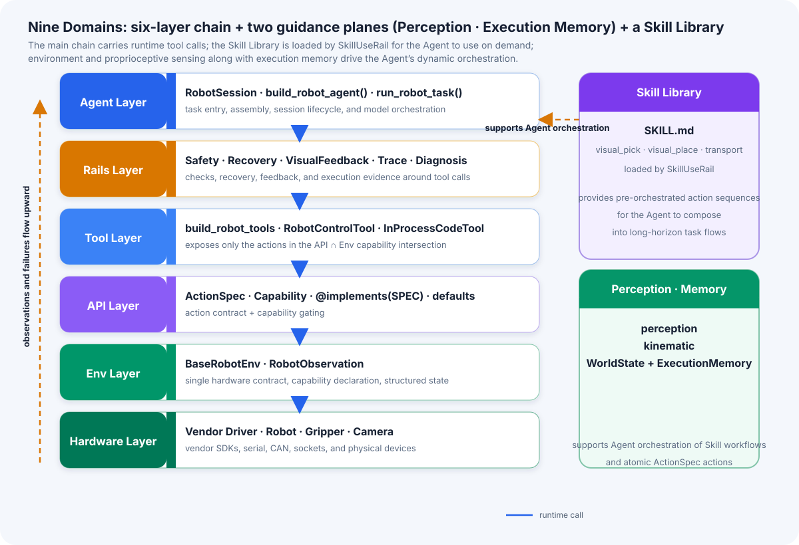
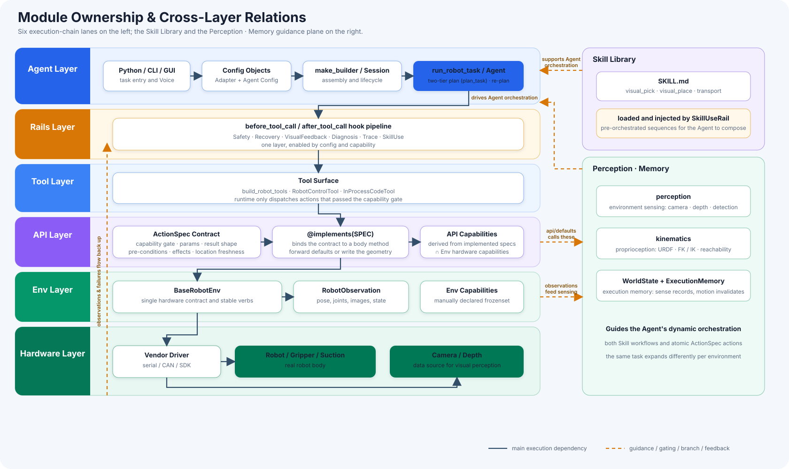
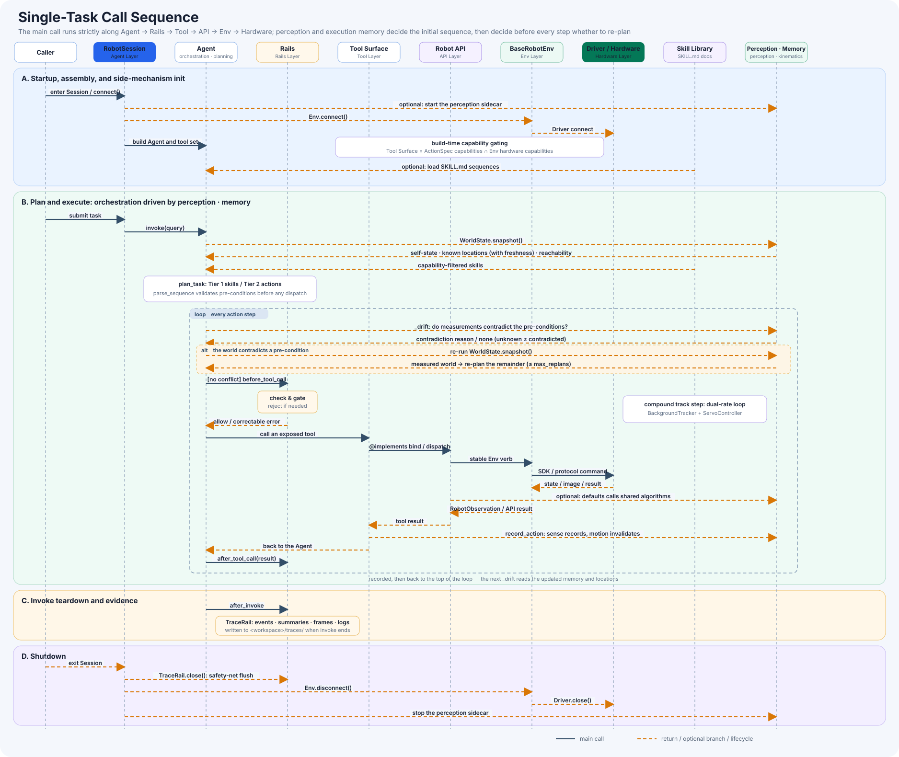

# JiuwenSymbiosis Architecture

> Category: Explanation. The [Chinese source](../../zh/explanation/architecture.md) is authoritative.

JiuwenSymbiosis is an embodied-agent framework built on `openjiuwen` whose design goal is to adapt **one codebase to different robot forms** — 6-DoF arms, mobile dual-arm bodies, grippers, suction. Its core is a **shared action vocabulary (ActionSpec) + capability gating**: adding a new body needs only 1 YAML config and 6 adapter files, with no change to the framework core.

---

## 1. Architecture overview

At runtime this is a **Perceive → Plan → Execute → Observe → Feedback** loop: commands flow down the six-layer Agent → Rails → Tool → API → Env → Hardware chain, while observations, failures, and trace evidence flow back up. The framework is made of **nine architectural domains** — the **six-layer execution chain**, plus **two guidance planes** (perception, execution memory) and the **Skill Library**, all joining from the side:



| Domain | Made of | Role |
|---|---|---|
| Six-layer execution chain | Agent · Rails · Tool · API · Env · Hardware | Carries every runtime tool call: commands down, observations and failures up |
| Guidance plane ①: perception | `perception` (environment sensing: camera / depth / detection) + `kinematics` (proprioception: URDF / FK / IK / reachability) | Hands the planner the current facts about the environment and the body |
| Guidance plane ②: execution memory | `WorldState` + `ExecutionMemory` (`api/memory.py`) | Sensing books it in, a move invalidates it — so the planner always reads fresh positions |
| Skill Library | SKILL.md under `skills/`: `visual_pick` / `visual_place` / `transport` | Supplies **pre-orchestrated action sequences**, loaded by SkillUseRail, for the Agent to compose into long-horizon task flows |

The two guidance planes together drive the Agent's **dynamic orchestration** — of skills and of atomic `ActionSpec` actions alike: the same task expands into a different sequence in a different environment.

The module map below uses the same structure: six lanes on the left form the execution chain, while the right groups the Skill Library and the "Perception · Memory" guidance plane.



The order of one task is shown separately as a sequence diagram. The six-layer main chain maps one-to-one to Agent → Rails → Tool → API → Env → Hardware; the Skill Library and the perception / execution-memory guidance planes join as side participants:



Key call paths:

| Scenario | Call relationship |
|---|---|
| Startup | YAML → Adapter Config → `make_builder()` → Session(Env/Api/sidecars); RobotAgentConfig + Session → `run_robot_task()` |
| Ordinary tool | Agent → Rail precheck → Tool → `@implements` method → `defaults`/shared algorithm → Env verb → Driver → hardware |
| Visual tool | `defaults` → `perception/scene3d` → camera frames → detector sidecar → adapter raw projection → shared correction and grasp/place geometry |
| Dynamic orchestration | Re-measure `WorldState` before each step; re-plan when it contradicts the next step's pre-conditions |
| Realtime servo | `BackgroundTracker` perception thread keeps refreshing the latest target → `ServoController` high-rate slew-limited stepping → env non-blocking servo verb |
| Evidence | Driver/camera → `RobotObservation`/tool result → VisualFeedback/Trace/Diagnosis → next model turn or offline analysis |
| Shutdown | `RobotSession.disconnect()` → Trace finalization → `Env.disconnect()` → `Driver.close()` → sidecar exit |

See the [Feature Matrix](../reference/feature-matrix.md) for current framework and built-in adapter support.

Every item in the README "Core Features" list lands on a concrete mechanism and section:

| README Core Feature | Architectural mechanism | Section |
|---|---|---|
| Body agnostic | Shared `ActionSpec` vocabulary + capability gating + 6-file adapter | 2, 3, 4, 12 |
| Task composition | Two-tier planning: skill composition `compile_sequence` / action composition `compose_actions` | 6 |
| Environment- and body-aware dynamic orchestration | The same task is **not a fixed sequence** — the planner takes the live body state + ambient sensing as input and **different environments produce different sequences**; at run time a conflict with a pre-condition triggers re-planning | 6, 9 |
| Execution memory | `ExecutionMemory` (`api/memory.py`): sensing books it in, a move invalidates it | 3 |
| Real-time tracking servo | `agent/fast/realtime` dual-rate loop: `BackgroundTracker` + `ServoController` | 6 |
| Active search | `search_target` sweeps and reports a bearing → `approach_*` closes in step by step | 3, 10 |
| Reachability reasoning | Body-agnostic `kinematics` (URDF/FK/IK) + planning-time judge `Reachability` + `reachable` annotation in `WorldState` | 4, 6 |
| Action contracts | `ActionSpec`'s `requires`/`provides`/`invalidates` + location freshness | 3 |
| Safety loop | SafetyRail / RecoveryRail / VisualFeedbackRail / DiagnosisRail | 7 |
| General visual perception | Shared `perception/` pipeline + one projection function per adapter | 3, 10 |
| Skill workflows | SKILL.md + SkillUseRail (tool path) / `compile_sequence` (fast path) | 5, 6 |
| Auditable execution | TraceRail structured traces + `jiuwensymbiosis-replay` | 8 |

Below, layer by layer from the bottom up, focusing on **how an action contract is declared, gated, and finally becomes an LLM tool**.

---

## 2. Env is the single hardware contract

`jiuwensymbiosis/env/base.py` defines the interface every robot env must satisfy. It does **not** drive hardware directly — it holds a `low_level` driver and delegates. Each env declares what its hardware can do:

```python
# env/mock.py: a simulated 4-DoF arm with gripper and camera
capabilities = frozenset({
    "motion.cartesian", "grasp.parallel",
    "vision.camera", "vision.detection",
})
```

`BaseRobotEnv` provides a set of default verbs (`home`, `get_flange_pose`, `move_to_flange`, `move_joint`, `set_end_effector`, `grab_rgb`) and exposes safety-boundary properties (`z_min_safe`, `workspace_bounds`, `joint_limits`, `base_step_limits`, `lift_limits`, `waist_step_limit_rad`) plus body constants (`home_pose`, `tool_offset_mm`). Each defaults to `None` = **no range check** (type/finite checks still run). These are the **data** SafetyRail reads; an adapter author only fills them in, never writes check logic.

The env also exposes body constants for upper-layer geometry and reachability:

- `joint_units` — `"deg"`/`"rad"`/`None`, the unit of `move_joint` and observed joints (**unstated is treated as unknown**; the planner never guesses)
- `default_orientation_policy` — the default tilt `goto_xyzr` applies when `orientation_policy` is omitted
- `urdf_path` / `arm_chains` — provided when the body has a URDF; `planning.reachability` is **derived** from them (never declared); `arm_joints` declares which joints each arm actuates
- `cameras` — the cameras this body can perceive with (`("waist", "head")`, best-first)

### Known capabilities (`KNOWN_CAPABILITIES`)

Defined in `env/base.py`, the framework-wide closed vocabulary:

| Capability | Meaning |
|---|---|
| `motion.cartesian` | XYZ(R) end-effector commands in base frame |
| `motion.joint` | Joint-space commands |
| `motion.servo` | Non-blocking streaming servo pose commands |
| `motion.base` | Planar mobile-base relative motion (differential; no strafe) |
| `motion.base_servo` | Non-blocking streaming base drive (steer-while-moving) |
| `motion.lift` | Vertical torso/lifter position control |
| `motion.waist` | Torso yaw (waist) rotation |
| `motion.goal` | Autonomous drive to a goal/grasp-band via a nav stack |
| `motion.dual_arm` | Two arms in coordination — a **topology** axis, deciding which action to call; what the arms hold is declared separately by `grasp.*` |
| `grasp.suction` | Suction on/off |
| `grasp.parallel` | Parallel gripper open/close |
| `grasp.paddle` | Two flat plates clamping a face each side — an **end-effector** capability, an independent axis from `motion.dual_arm` |
| `vision.camera` | Raw image stream available |
| `vision.depth` | Depth stream available |
| `vision.detection` | High-level object detection |
| `vision.eye_to_hand` | Camera fixed in the robot base/world frame |
| `vision.search` | The body can turn whatever carries a camera to search — reports only a **bearing** |
| `planning.reachability` | URDF-based reachability / workspace prior (**derived**, never declared) |
| `sorting.command` | Opaque sorting protocol (no Cartesian motion) |
| `speech.tts` | Text-to-speech available |

Capability axes are **orthogonal and freely combinable**: whether two arms coordinate (`motion.dual_arm`), whether the body lifts/turns (`motion.lift`/`motion.waist`), whether it searches for a target (`vision.search`), and whether grasping is by gripper or paddle (`grasp.parallel`/`grasp.paddle`) are all independent. One action belongs to exactly one capability; a body declares what it has, and a task is orchestrated across capabilities by pre-conditions.

The framework ships `MockArmEnv` (`jiuwensymbiosis/env/mock.py`), which runs the **whole chain with no hardware**; its LLM counterpart is `MockModel` (injected on `--mock`, `invoke` returns fixed text and skips `api_key` validation). Together they close the loop for a "no hardware + no LLM" pure-logic dry run.

---

## 3. API layer: the action contract and `@implements`

This layer is the heart of the framework, made of three symbols:

- **`ActionSpec`** — the contract of an action, declared in `api/actions.py`. It states what an action **is**: name, description, capability gate, parameter names, result shape, pre-conditions and effects, location freshness, and whether it is visible to the planner.
- **`@implements(SPEC)`** — binds a method as one body's implementation of a contract. The contract comes **entirely from the spec**; an implementation has no channel for telling the planner something outside the vocabulary. It attaches a `ToolMeta` (the spec + `input_params`, the call schema derived from *this* body's signature), which `build_robot_tools` wraps into openjiuwen `LocalFunction` tools.
- **`api.defaults`** — actions whose implementation is one line of delegation to an Env verb (`goto_xyzr` is `env.move_to_flange(...)`). These **free functions** are called explicitly by the adapter: `@implements(GOTO_XYZR)` then `return defaults.goto_xyzr(self, ...)`. **Not a base class** — inheritance would bundle unrelated actions, and the MRO would decide which of two mixins won a name. A function takes only what it needs.

Adapter example:

```python
class PiperApi(BaseRobotApi):
    @implements(GOTO_XYZR)
    def goto_xyzr(self, x: float, y: float, z: float, r: float | None = None,
                  *, orientation_policy: str = "top_down") -> None:
        return defaults.goto_xyzr(self, x, y, z, r)
```

`BaseRobotApi.capabilities` is **auto-derived** from the actions a body implements (each `@implements` spec contributes its capability), plus any declared marker-capability class attribute (`motion.servo`, `planning.reachability`, which have no corresponding action). **The adapter author never maintains a capability list by hand** — implementing an action automatically grants its capability, and never advertises a capability the body has not got.

`home` is the one unconditional action (`capability=None`) and lives on `BaseRobotApi` (every body owes a safe return), delegating to `env.home()`. There is deliberately no second "home_safely" — safe homing is **one thing**; how much motion it takes is implementation.

### The planning contract: callable, and also plannable

Beyond the call schema, every action carries:

- `result` — the JSON Schema of result fields, auto-derived from a `TypedDict` return annotation (success and failure shapes usually merge into a union; `contracts.py` is the **single source of truth** for these result types — owned by no layer, imports nothing from the package, so `api/` promises them and `perception/`+`motion/` build them without a cycle)
- `requires` / `provides` / `invalidates` — robot self-state, over the closed vocabulary in `api/state.py:KNOWN_STATE_TOKENS`
- `produces_location` / `consumes_location` / `invalidates_locations` — location freshness (an action that senses where something is *produces*; one that moves the base *invalidates* every prior location, since they were measured from the old standpoint)

A contract **never encodes an order** — it states pre-conditions and effects so a planner can *derive* a legal order; `parse_sequence` accepts any permutation whose pre-conditions hold. `WorldState.snapshot(session)` reports the same vocabulary at runtime (observation overrides belief; an absent token means *unknown*, never *false*).

### Execution memory: sensing books it in, a move invalidates it

`BaseRobotApi` holds an `ExecutionMemory` (`api/memory.py`) — the **single ledger** of "what the planner knows right now". After every action, `record_action` folds the result into it: an action declaring `produces_location` records a timestamped location under its referent (sensing books it in); one declaring `invalidates_locations` (moving the base, turning the waist) goes through `invalidate_sensing_cache`, the **single invalidation gate**, which clears the old locations and the sensing cache together (a move invalidates them — they were measured from the old standpoint).

The ledger is driven entirely by the action contract — **no hand-written cache** anywhere. Adapter authors do not maintain it and the planner never guesses. Bookkeeping is best-effort: a failed record can never turn a successful robot action into a tool failure. `WorldState.snapshot` reads its location list straight from this ledger's `describe()`, so planner and executor agree on what is known, and state settled by an earlier action is inherited by later steps (`<bind>.field`).

### Vision: a shared pipeline plus one projection function

`perception/` provides the body-agnostic shared pipeline, and the visual actions in `api/defaults` forward into it. An adapter contributes exactly **one projection function** (`_project_pixel_to_base_raw`): eye-in-hand combines the live flange pose `T_base_flange @ T_flange_cam`, eye-to-hand uses a fixed `T_base_cam`; **no xy/z correction** (the shared geometry owns that). `scene3d`'s `locate_for_grasp`/`locate_for_place`/`analyze_scene` are the detect→centroid/median-depth→raw projection→correction→grasp/place-geometry chain; `motion/approach`'s `search_target`/`approach_for_grasp`/`approach_for_place` are search→face the target→converge to a work pose. The z math and ground truth happen in one place.

**Active search** is the opening move of that chain and is gated separately by the `vision.search` capability: when the target is out of view, `search_target` sweeps in place and reports only a **bearing** — it deliberately does **not** `produces_location`, because a reading with no world coordinate must not pollute location freshness. Given the bearing, `approach_*` takes over: it squares up to the sensed bearing, re-measures before each pass, and converges step by step to a graspable/placeable work pose.

---

## 4. Capability gating: tools align with hardware automatically

This is the core mechanism behind "one codebase, all forms" — three steps:

1. **Env declares** what hardware can do (manual `frozenset`)
2. **Api derives** its own capabilities (from the specs of the actions it implements)
3. **`build_robot_tools(api, env=env)` takes the intersection** — only actions in `api.capabilities ∩ env.capabilities` become LLM tools

The key difference: the capability comes from the **action's own `ActionSpec`**, never from whichever class declares the method — eliminating the old failure mode of walking the MRO for a `capability` attribute and gating every tool an adapter declared alongside its vision tools.

**Effect**: install a gripper implementation on a suction-only body, and the gripper tool never appears in front of the LLM. Capabilities the hardware lacks are entirely invisible to the agent, preventing "the LLM tells a suction robot to open the gripper" from the source.

The gate set uses `env.effective_capabilities` (declared | + `planning.reachability` **derived** from a shipped URDF). **`planning.reachability` is derived**: the Api half is "the body holds a reach judge" (`check_reachable`/`describe_reach`), the Env half is "the body ships the URDF the judge reads" — only the intersection is true, which stops a body claiming reach while shipping no model. Behind the judge sits the body-agnostic `kinematics/` package (URDF parsing + FK + numerical IK + reach / self-collision, pure numpy, with the URDF path and joint names all passed in) — the "proprioception" cell in the architecture diagram.

The planner consumes reachability through **two entry points**, both planning-time judgments rather than a run-time bounce off SafetyRail:

- **Per-location annotation in `WorldState`**: `snapshot` calls `check_reachable` for every known location and attaches a `reachable` verdict — when it cannot judge (no URDF / judge failure) it **omits the key**, never a false "unreachable". At plan time this shows either "the target is inside the envelope → schedule the grasp" or "not reachable from here → schedule a base/approach step first to make it reachable".
- **Spatial-relation grounding**: when the task describes the target as "in the drawer" or "under the crate", the small closed set `contracts.py:SPATIAL_RELATIONS` (`on`/`under`/`in`/`beside`/`near`) first grounds the target to a reference and measures against it; an occluded or enclosed target therefore needs a step that makes it reachable first. That closed set is **deliberately viewpoint-independent**, so target descriptions, detection grounding, and reachability reasoning share one relation vocabulary.

---

## 5. Tool layer: three strategies can coexist

`agent/builder.py`'s `_build_tools` assembles the tool list; the three strategies coexist:

| Strategy | Best fit | Shape |
|---|---|---|
| `build_robot_tools(api)` | Few tools | One LLM tool per `@implements` method |
| `RobotControlTool(api)` | SKILL.md workflows | Single `robot_control` entry, `action`/`params` dispatch |
| `InProcessCodeTool` | `mode="code"/"hybrid"` | **In-process** Python, sees the live in-memory `env` |

`mode` values: `"tool"` (only `build_robot_tools`), `"code"` (only `InProcessCodeTool`), `"hybrid"` (default, both).

`InProcessCodeTool`'s motivation: openjiuwen's built-in `CodeTool` runs in a sandboxed subprocess and cannot see the live objects in the agent process — but robot control precisely needs those hot objects (the connected `env`, a warmed camera, the detector client). The framework therefore provides an **in-process executor**, injecting `{env, api, np, ...}` globals at each `exec()`.

### Transparent unwrapping by safety rails

When `RobotControlTool` is used, every action goes through one `robot_control` entry with `action`/`params` hidden in the params. SafetyRail **transparently unwraps** before applying the check, so safety works regardless of tool strategy.

---

## 6. Two-tier autonomous planning (`exec_mode: fastagent`)

`agent/fast/planner.py:plan_task` turns a task into one flat action sequence, then `run_sequence` executes it with **no per-step LLM call**:

- **Tier 1 — skill composition** (`compile_sequence`): given the world state and the capability-filtered skill library, pick the skills and expand their workflows into a flat sequence in **one** inference. The happy path therefore costs exactly one LLM round trip.
- **Tier 2 — action composition** (`compose_actions`): no SKILL.md at all — derive a sequence from the action contracts (`requires`/`provides`/location freshness) alone. It takes over on exactly three **decidable** conditions, never on the model's say-so: ① no skill survives the capability gate; ② Tier 1 returns an explicit empty array; ③ Tier 1 exhausts its correction retries — which subsumes "the chosen skills' pre-conditions cannot hold from the current state", since `parse_sequence` rejects that expansion and feeds the reason back.
- **`parse_sequence`** (`agent/fast/sequence.py`): the safety net between them — it simulates the state forward, checks `requires ⊆ state`, validates every `<bind>.field` against the producing op's `returns`, and names *which action would produce* a missing pre-condition so the compiler's retry loop can self-correct. It rejects unmet pre-conditions, **not** orderings — any permutation that type-checks is accepted.
- **Runtime re-planning** (`runner.py`): before each step the runner re-measures `WorldState` and re-plans (capped by `max_replans`) when the world *contradicts* the next step's pre-conditions. Contradiction, not absence — a body that cannot report a token is ignorant, not falsified, and treating ignorance as falsehood would re-plan forever.

In particular, `WorldState` reports "**observation overrides belief, an absent token is unknown**" (a token such as `payload.held` that the env can measure has observation override belief; locations carry reachability annotations — a verdict the judge cannot give is omitted, never reported as "out of reach"). Its location list comes straight from `ExecutionMemory` (see §3 "Execution memory"). This is how a task truly **recovers dynamically** after a move, when sensing goes stale, or when the body cannot reach from where it is, rather than executing a script.

### Real-time tracking servo: perceive while acting

A grasp/place need not be a single-shot "snap one frame → compute once → drive blind" step. The fast path compiles **approach/descend into compound track steps** (`TRACK_DETECT`/`TRACK_GRASP`) and executes them with a **dual-rate loop**:

- **Perception half** (`BackgroundTracker`, `agent/fast/realtime/tracking.py`): a daemon thread runs `detect_fn` continuously at whatever rate the detector can sustain, keeping only the **latest** target pose; `staleness_s` is **mandatory** — an older-than-staleness target reads as `None` (lost), so there is no "never set an expiry and drive motion from an arbitrarily old frame".
- **Control half** (`ServoController`, `realtime/servo.py`): at a fixed `control_hz` (≈30 Hz) each tick reads the current pose, takes the latest target, **slew-limits** a step toward it (so a far or jumpy detection cannot cause a violent jump), then sends a **non-blocking** `servo_to`. Poses are plain `dict`s, so the same controller drives a 4-DoF SCARA (`x,y,z,r`) and a 6-DoF arm (`x,y,z,rx,ry,rz`).
- **`ServoBinding`** (`realtime/binding.py`) is the one place that knows how to pull generic servo IO out of a session: `read_pose`→`api.get_pose`, `servo_to`→`api.servo_to_tip` (falling back to `env.servo_to_flange`), `grip`, `frames`. It requires the env to declare `motion.servo` — a body that cannot servo is a **config error**, not a mystery hang. `MaskTargetFilter` (`realtime/mask_tracking.py`) further filters jumps with the mask.

This "slow detection / fast control" split is what lets a seconds-scale GroundingDINO+SAM2 drive a smooth high-rate servo: the loop always slews toward the freshest known target instead of stalling on the next frame, and only gives up once the target is lost for `lost_target_grace_s`. This is README's "real-time tracking servo": track the target, stream high-frequency commands, and follow a moving object for real-time grasping.

Distilling a successful Tier 2 sequence back into a SKILL.md is **not implemented**; today a new skill is authored by hand (see §6 "Two-tier autonomous planning" above).

---

## 7. Safety rails: three lines of defence plus a parallel observer

`jiuwensymbiosis/rails/` provides `before_tool_call` hooks that intercept/backstop before tool execution, enabled by `RobotAgentConfig` flags and gated by session capabilities:

### 1. SafetyRail — a software precheck before motion

Intercepts `goto_xyzr`/`goto_pose`/`move_joint`/`move_direction`/base/torso commands, deriving checks from declared capabilities: cartesian → Z floor + XY workspace; joint → joint soft limits (`joint_limits`, unit matching `move_joint`); base/turn_waist → per-command translation/turn caps; lift → `lift_limits`. Each boundary defaults to `None` = **no range check** (type/finite still run). Violations `raise ValueError` (per-failure message), converted by openjiuwen into a tool-exception fed back to the LLM **to self-correct**. It is a **complement to, not a replacement for**, the hardware E-stop.

### 2. RecoveryRail — automatic reset after failure

On motion/grasp failure, auto-`home()` + release the end effector. `home` consults `env.holding_payload` first — a body still carrying a payload must not be homed blindly (that would drop it). Release goes through a generic `release_effector()` hook.

### 3. VisualFeedbackRail — capture and inject a post-action frame

Grabs a frame after every motion/grasp and injects it into context for VLM verification. Requires `vision.camera`. Two-phase injection (`after_tool_call` only stages the frame, `before_model_call` flushes it) keeps message order legal (a tool result must immediately follow its tool call).

**Additionally**:
> `SkillUseRail` (`agent/builder.py`), not a safety rail — attached only when `enable_skill=True`, loads the built-in `SKILL.md` and appends `RobotControlTool`.
> `TraceRail` (`agent/trace.py`), the parallel observation rail, described in the overview.
> `DiagnosisRail` (`rails/diagnosis.py`), depends on `TraceRail`, injects diagnosis evidence into the next model call after failure — see [Use the Trace Feedback Loop](../how-to/use-trace-feedback.md).

> **Parallel tool calls are off by default, with motion hard-rejected**: `parallel_tool_calls` defaults to `False`, and `build_robot_agent` raises `ValueError` when it is `True` and the env has `motion.*`/`grasp.*`; non-motion (`vision.*`/`speech.tts`) may run in parallel. **TraceRail and parallelism are mutually exclusive.**

---

## 8. Execution trace and replay (TraceRail)

`TraceRail` (`jiuwensymbiosis/agent/trace.py`) is a **parallel observation rail** — it does not intercept or backstop actions, it only collects and persists. Enabled via `enable_tracing` (default **off**, zero overhead). It hooks openjiuwen lifecycle events and changes no `@implements`, env, or other rail.

Each tool call records a `TraceEntry`: action name (the real name after `robot_control` unwrap), params, success/error, duration, a pose snapshot (**no** raw rgb/depth), and an optional JPEG frame. Rail events come from two complementary mechanisms: the `TraceEventSink` notification hooks (the three safety rails push structured results at their true trigger points), and `TraceLogHandler` captures `WARNING`+ logs from `trace_capture_loggers` (default `jiuwensymbiosis`) — no business-code changes.

An invoke writes one JSON to `<workspace>/traces/{run_token}.json`; frames (optional) go to `traces/frames/{run_token}/step_NNN.jpg`. `jiuwensymbiosis-replay <trace.json>` renders a self-contained HTML replay by default; `--text` falls back to a plain-text timeline.

Field semantics, full config table, and serialization rules are in the [Execution Tracing Reference](../reference/tracing.md). A bundled sample lives in `examples/sample_trace/`.

---

## 9. RobotSession: the lifecycle aggregator

`jiuwensymbiosis/agent/session.py` is a context manager — `with session:` does connect/disconnect, both **idempotent**. It aggregates:

- `env` (the hardware driver instance)
- `api` (the action-implementation object)
- `sidecar_starters` (e.g. the detection subprocess, auto-started on connect, stopped on disconnect)
- `globals_provider` (globals injected into `InProcessCodeTool`)

`connect()` also runs a **capability-consistency check**: an api capability the env does not support is a **hard failure** under `strict_capabilities=True` (a `ValueError` with fix guidance); an env-only capability is always just a warning (that is "one tool fewer", not a config error). `describe()`'s `effective_capabilities` is exactly the `env ∩ api` intersection.

`globals_provider`'s `{env, api, np, **extra_globals}` is reflected into a "available globals" declaration in the system prompt by `build_robot_agent`, so an adapter author can add `extra_globals["my_helper"] = ...` without hand-editing the prompt.

---

## 10. Visual perception: detector as a subprocess

Detection (GroundingDINO + SAM2) runs in a **separate subprocess**, communicates over HTTP (`perception/detector_client.py`), and `RobotSession` manages its lifecycle through `sidecar_starters` — the adapter author never deals with start/stop.

Data flow:

```
Camera frame (RGB + depth)
   │
   ▼
scene3d.locate_for_grasp / analyze_scene
   │   detection → best mask + centroid (u,v) + median depth
   ▼
adapter _project_pixel_to_base_raw (one step, eye-in-hand / eye-to-hand)
   ▼
apply_xy_correction / build_grasp_result  (shared geometry: xy/z correction + grasp/place height)
   ▼
{position, grasp_position, place_position, ...}
```

`api/defaults`' `locate_for_grasp`/`locate_for_place`/`analyze_scene` forward to `perception/scene3d`; `search_target`/`approach_for_grasp`/`approach_for_place` forward to `motion/approach` — **the same one implementation path as every other action** (there is no second channel).

---

## 11. `make_builder`: removing boilerplate

Each adapter provides `build_xxx_session`, supporting three invocation shapes (config / YAML / dict). `adapters/_common/builder.py`'s `make_builder` wraps constructing env → api → collecting sidecars → assembling `RobotSession` → optional `decorate`:

```python
build_xxx_session = make_builder(
    XxxConfig, XxxEnv, XxxApi,
    api_kwargs_from_cfg=["z_correction_mm", "detector.url:detector_service_url"],
    sidecar_builders=[make_detector_sidecar()],
    decorate=_set_extra_globals,
)
# Afterwards: build_xxx_session(cfg) / .from_yaml("path.yaml") / .from_dict({...})
```

`api_kwargs_from_cfg` is a **declarative** field mapping (same-name passthrough / `cfg:api` rename / dotted-path into nested objects), with a callback for backward compatibility when declarative cannot express a transform. `make_detector_sidecar()` wraps reading GroundingDINO+SAM2 sidecar params from `cfg.detector` and deciding by `spawn` — a vision adapter's `session.py` becomes truly one line.

---

## 12. How cheap is new-hardware integration

The answer is **6 files + 1 YAML**, most of them filled in from a template:

| File you write | What you actually do | Template-generatable? |
|---|---|---|
| `config_template.yaml` | Fill in hardware parameters (CAN port, jaw travel, Z floor, …) | ✅ guided by annotated comments |
| `config.py` | `@dataclass` + `from_yaml()`/`from_dict()` | ✅ template gives it |
| `lowlevel.py` | Driver: translate serial/CAN/Socket into `move_to_pose_blocking(pose, ...)` and friends | ⚠️ the only place real hardware logic lives |
| `env.py` | `BaseRobotEnv` subclass: declare `capabilities` + expose safety/geometry properties and body constants | ✅ template gives it |
| `api.py` | `@implements(SPEC)` bindings per action; forward to `defaults` when there is no geometry difference, write the body when there is | ✅ most methods need no hand-writing |
| `session.py` | `make_builder(...)` one-liner | ✅ one line |

The point: **most methods in `api.py` need no implementation of your own** — `defaults` delegates high-level actions like `goto_xyzr` to `self.env.<verb>()`. Only when the body geometry departs from the standard assumption do you override (e.g. Piper's tilted tool, tip ≠ flange, so it overrides `goto_xyzr` for the tip→flange conversion).

Two commands verify the result:

```bash
python scripts/validate_adapter.py --module jiuwensymbiosis.adapters.my_robot       # static structure
python scripts/smoke_test_adapter.py --module jiuwensymbiosis.adapters.my_robot    # runtime smoke
```

---

## 13. Complete new-hardware integration flow

1. **Copy the template** `templates/xxx_adapter/` → `jiuwensymbiosis/adapters/acme/`
2. **Fill the YAML** `config_template.yaml` (CAN port, jaw travel, Z floor, workspace bounds, …)
3. **Write `lowlevel.py`** — the only hardware logic: translate the vendor SDK into `move_to_pose_blocking(pose, ...)` / `set_gripper` / `grab_frames` and friends
4. **Write `env.py`** — declare the `capabilities` frozenset, expose safety/geometry properties and body constants
5. **Write `api.py`** — `@implements(SPEC)` bindings per action; write a method body only for geometry differences; vision needs just the projection function `_project_pixel_to_base_raw` (the flow is shared by `scene3d`/`approach`)
6. **Write `session.py`** — `make_builder(...)` one-liner
7. **Static validation** `python scripts/validate_adapter.py --module jiuwensymbiosis.adapters.acme`
8. **Runtime smoke** `python scripts/smoke_test_adapter.py --module jiuwensymbiosis.adapters.acme`
9. **Mock run** `python examples/run_task.py --config ... --mock` — validate the logic before hardware exists

**The framework core (agent/api/env/tools/rails) changes nowhere.** This is the leverage of the shared-action-vocabulary architecture: "form differences" collapse entirely into the adapter directory; "common capabilities" sediment into composable action contracts.

More detailed hardware porting steps are in [Port a Robot Hardware Adapter](../how-to/port-hardware-adapter.md).

---

## 14. Summary of key design principles

| Design | Payoff |
|---|---|
| `ActionSpec` is the one contract of an action | 20 of 39 action names once carried 2–4 drifted copies; a single contract cannot drift |
| `ToolMeta` holds its spec rather than copying it | Contract fields exist in one place; what the planner reads cannot disagree with the vocabulary |
| `@implements` binds each action | The adapter file is the body's capability list, replacing a base-class tuple |
| `defaults` is a free function, not a base class | Taking one action never drags in its neighbours; the MRO stays flat |
| Capabilities derived from specs | Implement an action and you have its capability; never advertise one you have not got |
| `api ∩ env` intersection gates tools | Capabilities the hardware lacks are invisible to the LLM; no hallucination |
| Env is the only hardware contract | Changing hardware means changing env + driver; the upper layers are untouched |
| `contracts.py` is owned by no layer | Single source of truth for result shapes; `api/` and `perception/`+`motion/` do not depend on each other |
| `Reachability` is a planning-time judge | The planner reads "can I reach from here" up front, instead of being bounced by SafetyRail one step into the run |
| Two-tier planning + runtime re-planning | Compile the sequence in one LLM round trip; re-plan only when the world contradicts a pre-condition |
| `ExecutionMemory` is contract-driven bookkeeping | Sensing books it in, a move invalidates it — the planner always reads fresh locations, no hand-written cache |
| Tracking/servo dual-rate loop | A seconds-scale detector still drives a smooth 30 Hz servo, so grasp/place can follow a moving target |
| `SPATIAL_RELATIONS` closed set, viewpoint-independent | "in the drawer"-style target descriptions, detection grounding, and reachability reasoning share one relation vocabulary |
| `make_builder` factory | One line gets a session constructor supporting cfg/YAML/dict entries |
| Detector as a separate subprocess | Heavy model isolation; lifecycle automatic with the session |
| Rails transparently unwrap `robot_control` | Safety is independent of tool strategy |
| SafetyRail raises `ValueError`, not a hard stop | The LLM self-corrects without ending the whole run |
| TraceRail collects in parallel, off by default | One JSON + optional frames per invoke; replayable and reviewable, zero overhead when off |

---

**Conclusion**: JiuwenSymbiosis collapses the essential complexity of "robot-form diversity" into the adapter directory through **a shared action contract + capability gating + one hardware contract + plannable pre-conditions/effects**. For a developer, the cost of adding a new body is compressed to **1 YAML + 1 driver file + 4 fill-in files**, while the agent, safety, tool, and perception layers are ready out of the box — as soon as the env declares a capability, the tools and safety policies are in place automatically. Across bodies, one task transfers between forms; on the same body, tasks compose dynamically. At runtime it is a **Perceive → Plan → Execute → Observe → Feedback** loop: `ExecutionMemory` keeps the world state fresh, the tracking/servo dual-rate loop lets critical grasp/place steps perceive while acting, and structured traces plus replay make every run reproducible and reviewable.

---

## 15. Related internal designs

This page describes the stable user-facing architecture. The design intent, internal trade-offs, core data structures, and interface constraints of specific features live in the repository-root `design/`:

- [Execution Trace Module Design](../../../design/tracing.md): Trace lifecycle, event attribution, persistence, and bounds.
- [Trace Feedback Loop Module Design](../../../design/trace-feedback-loop.md): online diagnosis and offline failure clustering.
- [Logging Module Design](../../../design/logging.md): handler ownership, output isolation, and trace-log forwarding.
- [Voice Control Integration Module Design](../../../design/voice-control-integration.md): the voice front-end and text-task seam.

These maintainer-facing records explain implementation choices and do not replace Tutorial, How-to, or Reference pages.
