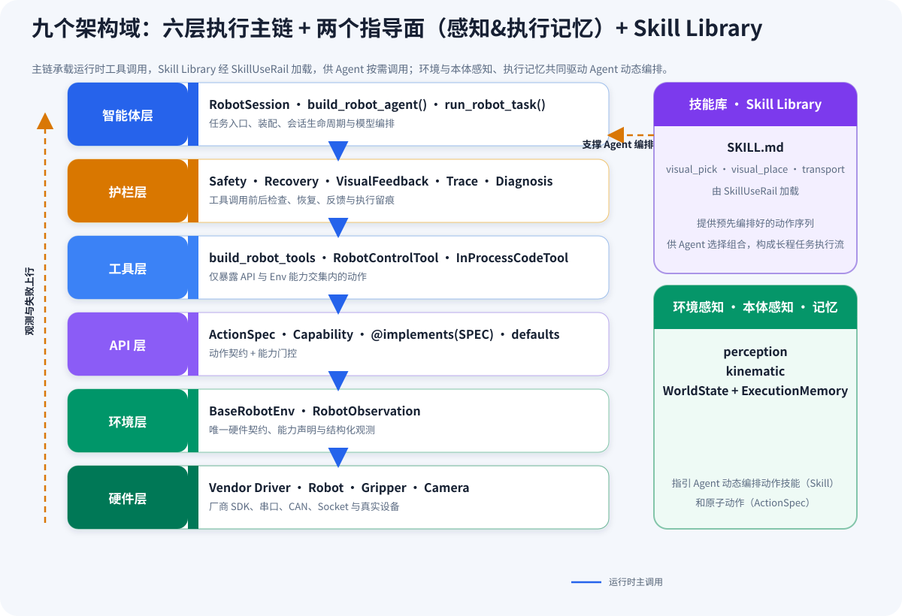
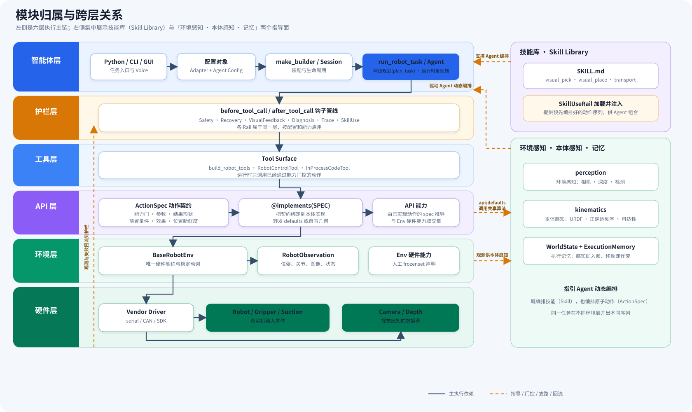
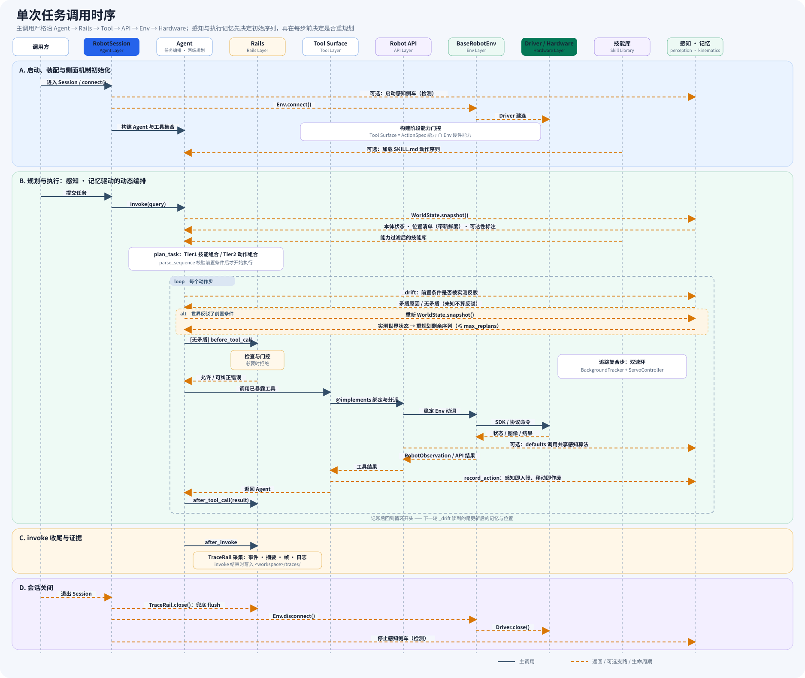

# JiuwenSymbiosis 架构指南

> JiuwenSymbiosis 是基于 `openjiuwen` 构建的具身智能体（embodied agent）框架，设计目标是让**同一份代码库适配不同机器人形态**——6-DoF、移动双臂、夹爪、吸盘等。其核心是**共享动作词表（ActionSpec）+ 能力门控**机制：新增一种硬件只需 1 份 YAML 配置和 6 个适配器文件，框架核心层无需修改。

---

## 一、架构总览

运行时形成「**感知 → 规划 → 执行 → 观测 → 反馈**」闭环：命令沿 Agent → Rails → Tool → API → Env → Hardware 六层主链向下，观测、失败与轨迹证据向上回流。框架由 **九个架构域** 组成——**六层执行主链**，加上从侧面接入的**两个指导面**（感知、执行记忆）与**技能库**：



| 架构域 | 组成 | 作用 |
|---|---|---|
| 六层执行主链 | Agent · Rails · Tool · API · Env · Hardware | 承载运行时的每一次工具调用：命令向下、观测与失败向上 |
| 指导面 ①：感知 | `perception`（环境感知：相机 / 深度 / 检测）+ `kinematics`（本体感知：URDF / 正逆运动学 / 可达性） | 把环境与本体的当前事实交给规划器 |
| 指导面 ②：执行记忆 | `WorldState` + `ExecutionMemory`（`api/memory.py`） | 感知即入账、移动即作废，保证规划器读到的位置始终新鲜 |
| 技能库（Skill Library） | `skills/` 的 SKILL.md：`visual_pick` / `visual_place` / `transport` | 提供**预先编排好的动作序列**，经 SkillUseRail 加载，供 Agent 选择组合成长程任务流 |

两个指导面共同指引 Agent **动态编排**——既编排技能（Skill），也编排原子动作（`ActionSpec`）：同一条任务在不同环境下展开出的序列并不相同。

下面的模块关系图与概览使用同一结构：左侧六条泳道对应执行主链，右侧集中放技能库与「环境感知 · 本体感知 · 记忆」两个指导面。



一次任务的先后关系单独用时序图表示。六层主链逐一对应为 Agent → Rails → Tool → API → Env → Hardware；技能库与「感知 · 执行记忆」指导面作为侧面参与者接入：



关键调用路径：

| 场景 | 调用关系 |
|---|---|
| 启动 | YAML → Adapter Config → `make_builder()` → Session(Env/Api/sidecars)；RobotAgentConfig + Session → `run_robot_task()` |
| 普通工具调用 | Agent → Rail 前置检查 → Tool → `@implements` 方法 → `defaults`/共享算法 → Env 动词 → Driver → 硬件 |
| 视觉工具调用 | `defaults` → `perception/scene3d` → 相机帧 → 检测 sidecar → 适配器 RAW 投影 → 共享校正与抓放几何 |
| 动态编排 | 每步前重测 `WorldState`，与下一步前置条件矛盾时自动重规划 |
| 实时伺服 | `BackgroundTracker` 感知线程持续刷新最新目标 → `ServoController` 高频限斜率步进 → env 非阻塞伺服动词 |
| 观测与诊断 | Driver/相机 → `RobotObservation`/工具结果 → VisualFeedback/Trace/Diagnosis → 下一轮模型或离线分析 |
| 关闭 | `RobotSession.disconnect()` → Trace 收尾 → `Env.disconnect()` → `Driver.close()` → sidecar 退出 |

当前框架与各内置适配器具体支持哪些能力，见[特性矩阵](../reference/feature-matrix.md)。

README「核心特性」每一项都能落回具体的架构机制与对应章节：

| README 核心特性 | 架构机制 | 章节 |
|---|---|---|
| 构型无关 | 共享 `ActionSpec` 词表 + 能力门控 + 6 文件适配器 | 二、三、四、十二      |
| 任务组合 | 两级规划：技能组合 `compile_sequence` / 动作组合 `compose_actions` | 六                    |
| 环境 + 本体感知的动态编排 | 同一个任务**不是写死的序列**：规划器以当前本体状态 + 环境感知结果为输入，**不同环境编排出的动作序列不同**；执行中现实状态与前置条件矛盾时触发重规划 | 六、九                |
| 执行记忆 | `ExecutionMemory`（`api/memory.py`），感知即入账、移动即作废 | 三                    |
| 实时追踪伺服 | `agent/fast/realtime` 双速环：`BackgroundTracker` + `ServoController` | 六                    |
| 主动搜索 | `search_target` 扫视报方位 → `approach_*` 逐步逼近 | 三、十                |
| 可达性推理 | 本体无关的 `kinematics`（URDF/FK/IK）+ 规划期判官 `Reachability` + `WorldState` 的 `reachable` 标注 | 四、六                |
| 动作契约 | `ActionSpec` 的 `requires`/`provides`/`invalidates` + 位置新鲜度 | 三                    |
| 安全闭环 | SafetyRail / RecoveryRail / VisualFeedbackRail / DiagnosisRail | 七                    |
| 通用视觉感知 | `perception/` 共享管线 + 适配器一个投影函数 | 三、十                |
| 技能工作流 | SKILL.md + SkillUseRail（工具路径）/ `compile_sequence`（快路径） | 五、六                |
| 可审计执行 | TraceRail 结构化轨迹 + `jiuwensymbiosis-replay` 回放 | 八                    |

下面自底向上逐层拆解，重点看**动作契约如何被声明、被门控、最终成为 LLM 工具**。

---

## 二、Env 层：唯一的硬件契约

`jiuwensymbiosis/env/base.py` 定义了所有机器人 env 必须实现的接口。它**不直接驱动硬件**——它持有一个 `low_level` 驱动并委托。每个 env 必须声明自己硬件支持的能力：

```python
# env/mock.py —— 一个 4-DoF + 夹爪 + 相机的仿真臂
capabilities = frozenset({
    "motion.cartesian", "grasp.parallel",
    "vision.camera", "vision.detection",
})
```

`BaseRobotEnv` 提供一组默认动词（`home`、`get_flange_pose`、`move_to_flange`、`move_joint`、`set_end_effector`、`grab_rgb`），并暴露安全边界属性（`z_min_safe`、`workspace_bounds`、`joint_limits`、`base_step_limits`、`lift_limits`、`waist_step_limit_rad`）和本体常量（`home_pose`、`tool_offset_mm`），每个默认为 `None` = **不做范围检查**（类型/有限数检查仍执行）。这些属性是 SafetyRail 读取的**数据**，适配作者只需填值，无需写检查逻辑。

env 还需暴露本体常量供上层几何与可达性使用：

- `joint_units` —— `"deg"`/`"rad"`/`None`，`move_joint` 与观测关节的单位（**未声明视为未知**，规划器不会猜测）
- `default_orientation_policy` —— `goto_xyzr` 省略 `orientation_policy` 时的默认倾角
- `urdf_path` / `arm_chains` —— 本体有 URDF 时提供，`planning.reachability` 据此**派生**（从不声明）；`arm_joints` 声明双臂各自驱动的关节
- `cameras` —— 本体可感知的相机列表（`("waist", "head")` 等，最佳优先）

### 已知能力（`KNOWN_CAPABILITIES`）

定义在 `env/base.py`，是全框架共享的能力词汇表：

| 能力字符串 | 含义 |
|---|---|
| `motion.cartesian` | base 坐标系下的 XYZ(R) 末端命令 |
| `motion.joint` | 关节空间命令 |
| `motion.servo` | 非阻塞实时伺服位姿命令 |
| `motion.base` | 平面移动底盘相对运动（差分，无横移） |
| `motion.base_servo` | 非阻塞连续底盘驱动（边走边转向） |
| `motion.lift` | 升降/躯干垂直位置控制 |
| `motion.waist` | 躯干偏航（腰部）旋转 |
| `motion.goal` | 经由导航栈自主驶向目标/抓取带 |
| `motion.dual_arm` | 双臂协同——**拓扑轴**，决定调用哪个动作；双臂夹持的是什么由 `grasp.*` 单独声明 |
| `grasp.suction` | 吸盘开/关 |
| `grasp.parallel` | 平行夹爪开/合 |
| `grasp.paddle` | 两块平板各夹目标一面——**末端能力**，与 `motion.dual_arm` 是两条独立轴 |
| `vision.camera` | 原始图像流可用 |
| `vision.depth` | 深度流可用 |
| `vision.detection` | 高层目标检测 |
| `vision.eye_to_hand` | 相机固定在机器人基座/世界坐标系 |
| `vision.search` | 本体可转动载着相机的东西（头/腰/底盘）找目标——只报告**方位（bearing）** |
| `planning.reachability` | 基于 URDF 的可达性/工作空间先验（**派生**，从不声明） |
| `sorting.command` | 不透明分拣协议（无笛卡尔运动） |
| `speech.tts` | 文本转语音可用 |

能力轴相互**正交、可自由组合**：双臂能否协同（`motion.dual_arm`）、能否升降/转腰（`motion.lift`/`motion.waist`）、能否转头找目标（`vision.search`）、夹持靠夹爪还是夹板（`grasp.parallel`/`grasp.paddle`）彼此独立。一个动作只属于一条能力，本体按需声明，能力组合成一条任务时按前提条件编排。

框架内置 `MockArmEnv`（`jiuwensymbiosis/env/mock.py`），**无需任何硬件即可跑通整条链路**；配套 `MockModel`（`--mock` 时注入，`invoke` 返回固定文本、跳过 `api_key` 校验）在 LLM 侧对应，两者一起让"无硬件 + 无 LLM"的纯逻辑干跑真正闭环。

---

## 三、API 层：动作契约与 `@implements`

这一层是整个框架设计的核心，由三个符号组成：

- **`ActionSpec`** —— 动作的契约，声明在 `api/actions.py`。它说一个动作「是什么」：名字、描述、能力门、参数名、结果形状、前置条件与效果、位置新鲜度与是否对规划器可见。
- **`@implements(SPEC)`** —— 把一个方法绑定为某条契约在本体上的实现。契约**完全来自 spec**，实现方没有渠道对规划器说词表之外的话。它把 `ToolMeta`（spec + 由这个本体签名推导的 `input_params`）挂到方法上，`build_robot_tools` 据此把它们包装成 openjiuwen `LocalFunction` 工具。
- **`api.defaults`** —— 一类动作的实现委托 Env 就能完成（`goto_xyzr` 就是 `env.move_to_flange(...)`），这些**自由函数**由适配器显式转发：`@implements(GOTO_XYZR)` 然后 `return defaults.goto_xyzr(self, ...)`。**不是基类**——继承会把不相关的动作捆绑进来，而函数只取所需的那一个。

适配器示例：

```python
class PiperApi(BaseRobotApi):
    @implements(GOTO_XYZR)
    def goto_xyzr(self, x: float, y: float, z: float, r: float | None = None,
                  *, orientation_policy: str = "top_down") -> None:
        return defaults.goto_xyzr(self, x, y, z, r)
```

`BaseRobotApi.capabilities` 属性**自动反推**自本体实现的动作（每个 `@implements` 的 spec 贡献自己的能力），再加上声明的 marker 能力类属性（`motion.servo`、`planning.reachability` 等没有对应动作、只能靠属性声明）。**适配作者无需手动维护能力列表**——实现哪个动作就自动具备哪个能力，且不会广告本体没有的能力。

`home` 是唯一无条件动作（`capability=None`），归属到 `BaseRobotApi`（所有本体都欠一个安全归位），它的实现委托 `env.home()`。没有第二个 "home_safely"——安全归位是**一件事**，归位需要多少动作是实现细节。

### 规划契约：除了可调用，还要可规划

除了调用 schema，每条动作还携带：

- `result` —— 结果字段的 JSON Schema，自动派生自 `TypedDict` 返回注解（失败/成功形状通常取并集，`contracts.py` 是这些结果类型的**唯一权威源**，归属任何层、不依赖包内其它模块——`api/` 承诺它们，`perception/`+`motion/` 构建它们）
- `requires` / `provides` / `invalidates` —— 本体自身状态，基于 `api/state.py:KNOWN_STATE_TOKENS` 的封闭词表
- `produces_location` / `consumes_location` / `invalidates_locations` —— 位置新鲜度（一个感知到目标在哪的动作**产生**；一个移动底盘的动作**作废**所有从旧视角测得的位置，因为它们是从旧位置测量的）

契约**从不编码顺序**——它只陈述前置条件和效果，让规划器**推导**一个合法顺序；`parse_sequence` 接受任何前置条件成立的排列。`WorldState.snapshot(session)` 在运行时用同样的词表汇报当前状态（观测覆盖推想；一个缺失的 token 表示**未知**，从不表示**false**）。

### 执行记忆：感知即入账、移动即作废

`BaseRobotApi` 持有一个 `ExecutionMemory`（`api/memory.py`），它是规划器「现在已知什么」的**唯一账本**：每次动作执行后，`record_action` 把结果折叠进记忆——声明了 `produces_location` 的动作按 referent 记一条带时间戳的位置（感知即入账）；声明了 `invalidates_locations` 的动作（移动底盘、转腰等）经 `invalidate_sensing_cache` 这一**唯一失效入口**把旧位置与感知缓存一并清空（移动即作废）。

这个账本完全由动作契约自动驱动，**不需要任何手写缓存**——适配作者不维护、规划器也不猜测。记账走 best-effort 路径，记失败绝不把一个成功的机器人动作变成工具失败。`WorldState.snapshot` 的位置清单正是从这份账本的 `describe()` 读出来的，所以规划器与执行器看到的是同一份「已知信息」，已执行动作沉淀下来的状态会被后续步骤自动继承引用（`<bind>.field` 绑定）。

### 视觉：共享管线 + 一个投影函数

`perception/` 提供本体无关的共享管线，`api/defaults` 的视觉动作向前转发。适配作者对视觉只需提供**一个投影函数**（`_project_pixel_to_base_raw`）：eye-in-hand 读实时法兰位姿组合 `T_base_flange @ T_flange_cam`，eye-to-hand 用固定 `T_base_cam`；**不做任何 xy/z 校正**（共享几何负责）。`scene3d` 的 `locate_for_grasp`/`locate_for_place`/`analyze_scene` 是检测→质心/中值深度→RAW 投影→校正→抓放几何整条链，`motion/approach` 的 `search_target`/`approach_for_grasp`/`approach_for_place` 是寻靶→对准目标面→收敛到工作位姿。z 数学与 ground-truth 只在一处发生。

**主动搜索**是这条链的起手式，且由能力 `vision.search` 单独门控：目标不在视野内时，`search_target` 原地扫视、只报**方位（bearing）**——它刻意**不产生坐标**（不 `produces_location`），因为一份没有世界坐标的读数不该污染位置新鲜度；得到方位后，`approach_*` 把它接过来：调头对准已感测到的方位 → 每轮逼近前重测，逐步收敛到可抓/可放的工作位姿。

---

## 四、能力门控（Capability Gating）：工具与硬件自动对齐

这是"一份代码适配所有形态"的核心机制，三步走：

1. **Env 声明**硬件能做什么（手动 `frozenset`）
2. **Api 推导**自己的能力（反推自它实现的动作的 spec）
3. **`build_robot_tools(api, env=env)` 取交集**——只有 `api.capabilities ∩ env.capabilities` 里的动作才变成 LLM 工具

关键区别：能力来自**动作自身的 `ActionSpec`**，从不来自哪个类声明了方法——这消除了旧设计中"沿 MRO 找 `capability` 属性、把适配器声明的所有工具一起门控"的失败模式。

**效果**：给一个只吸盘的机器人装上一个夹爪实现，夹爪工具根本不会出现在 LLM 面前。硬件不支持的能力对 agent 完全不可见，从源头杜绝"LLM 让吸盘机器人去开夹爪"这类问题。

门控集合用 `env.effective_capabilities`（声明的能力 | + 由 URDF **派生**的 `planning.reachability`）。**`planning.reachability` 是派生的**：Api 侧是"本体持有一个可达性判断器"（`check_reachable`/`describe_reach`），Env 侧是"本体带着判官读的 URDF"——只有交集为真才算数，这阻止一个本体声称可达却没有任何模型。判官背后是本体无关的 `kinematics/`（URDF 解析 + FK + 数值 IK + 可达/自碰撞，纯 numpy，URDF 路径与关节名皆入参），也就是架构图里「本体感知」那一格。

规划器有**两个入口**消费可达性，都是规划期判定而非运行时才被弹回：

- **`WorldState` 逐位置标注**：`snapshot` 会对每个已知位置调 `check_reachable`，给出一条 `reachable` 判定——判不了（没有 URDF/判官失败）就**省略 key**，绝不给一个假的不达。规划期就能看出「目标在可达范围内」直接编排抓取，或「当前够不着」→ 先编排底盘/接近动作把它变可达。
- **空间关系接地**：任务把目标描述成「在抽屉里」「箱子下」时，`contracts.py:SPATIAL_RELATIONS` 的封闭小集合（`on`/`under`/`in`/`beside`/`near`）先把目标**接**到参照物上，再对参照物量取位置；被遮挡/包裹的目标由此需要一步「先让目标变得可达」的编排。这条封闭集合**刻意与视点无关**，让目标描述和检测接地、可达性推理共享同一套关系词。

---

## 五、Tool 层：三种工具策略可共存

`agent/builder.py` 的 `_build_tools` 组装工具列表，三种策略可以并存：

| 策略 | 适用场景 | 特点 |
|---|---|---|
| `build_robot_tools(api)` | 工具少 | 每个 `@implements` 方法 → 一个独立 LLM 工具 |
| `RobotControlTool(api)` | SKILL.md 工作流 | 单一 `robot_control` 入口，`action`/`params` 分派 |
| `InProcessCodeTool` | `mode="code"/"hybrid"` | **进程内** Python 执行，能访问到内存中的 live `env` |

`mode` 取值：`"tool"`（仅 `build_robot_tools`）、`"code"`（仅 `InProcessCodeTool`）、`"hybrid"`（默认，两者并存）。

`InProcessCodeTool` 的设计动机：openjiuwen 内置的 `CodeTool` 在**沙盒子进程**里跑代码，看不到 agent 进程里的 live 对象——机器人控制恰恰需要拿到"已连接的 `env`、已预热相机、检测客户端"这些热对象。框架因此提供**进程内 executor**，每次 `exec()` 注入 `{env, api, np, ...}` 全局变量。

### 安全 Rails 的透明解包

当用 `RobotControlTool` 时，所有动作都走 `robot_control` 一个入口，`action`/`params` 藏在参数里。SafetyRail 会**透明解包**后再做安全检查，因此无论用哪种工具策略，安全检查都生效。

---

## 六、两级自主规划（`exec_mode: fastagent`）

`agent/fast/planner.py:plan_task` 把任务变成一条平坦动作序列，然后 `run_sequence` 执行它且**没有逐 step 的 LLM 调用**：

- **Tier 1 — 技能组合**（`compile_sequence`）：给世界状态和能力过滤后的技能库，挑技能 + 把它们的流程展开成扁平序列，**一次推理**。happy path 因此正好一次 LLM 往返。
- **Tier 2 — 动作组合**（`compose_actions`）：没有 SKILL.md，仅凭动作契约（`requires`/`provides`/位置新鲜度）推导序列。它在三个**可判定**的条件上接管，从不因模型自己说"我觉得"：① 技能库被能力门过滤空；② Tier 1 返回显式空数组；③ Tier 1 耗尽了修正重试（这包含了"所选技能的前置条件从当前状态无法满足"，因为 `parse_sequence` 拒掉该展开并回喂原因）。
- **`parse_sequence`**（`agent/fast/sequence.py`）：两者之间的安全网——往前模拟状态，检查 `requires ⊆ state`，验证每个 `<bind>.field` 对产生它的那个 op 的 `returns`，并**点名**哪个动作会产生缺失的前置条件，好让编译器的重试循环自我修正。它拒绝**前置条件不满足**，不拒绝**顺序**——任何类型检查通过的排列都被接受。
- **运行时重规划**（`runner.py`）：每步前重测 `WorldState`，在世界**反驳**下一步前置条件时重新规划（上限 `max_replans`）。是"反驳"不是"缺失"——本体报告不出一个 token 是**无知**，不是**被证伪**，把无知当假会永远重规划下去。

特别地，`WorldState` 每次都汇报"**观测优先于推想、缺失即未知**"（`payload.held` 之类 token 由 env 可测则观测盖过推想；位置带可达性标注——够得着才够得着，判据没说就省略 key）。它的位置清单直接来自 `ExecutionMemory`（见第三节「执行记忆」）。这使一条任务在移动后、感知失效或本体够不着时真正**动态**恢复，而不是照本宣科。

### 实时追踪伺服：边感知边执行

抓放不必是「拍一张 → 算一次 → 盲走一段」的单次流程。快路径把**逼近/下压编译成追踪复合步**（`TRACK_DETECT`/`TRACK_GRASP`），交给一个**双速环**执行：

- **感知半边**（`BackgroundTracker`，`agent/fast/realtime/tracking.py`）：在 daemon 线程里以检测模型能支撑的速率连续跑 `detect_fn`，只保留**最新**一个目标位姿；`staleness_s` 必填——目标超龄就读成 `None`（丢失），不存在"从未设过期所以用任意旧的帧驱动运动"。
- **控制半边**（`ServoController`，`realtime/servo.py`）：以固定 `control_hz`（约 30 Hz）每 tick 读当前位姿、取最新目标、**限斜率步进**一个步长（防止远处/跳变检测造成猛冲），然后发**非阻塞** `servo_to`。位姿是纯 `dict`，同一个控制器驱动 4-DoF SCARA（`x,y,z,r`）与 6-DoF 臂（`x,y,z,rx,ry,rz`）。
- **`ServoBinding`**（`realtime/binding.py`）是唯一知道"怎么从 session 抽出通用伺服 IO"的地方：`read_pose`→`api.get_pose`、`servo_to`→`api.servo_to_tip`（缺省 `env.servo_to_flange`）、`grip`、`frames`。它要求 env 显式声明 `motion.servo`——本体不会伺服是**配置错误**，不是一个神秘的挂死。`MaskTargetFilter`（`realtime/mask_tracking.py`）再用 mask 过滤跳变。

这个「慢检测 / 快控制」的双速率分离，让秒级的 GroundingDINO+SAM2 也能驱动平滑的高频伺服——循环始终朝最新已知目标滑步，而不是等下一帧检测；丢失超过 `lost_target_grace_s` 才放弃。它对应 README 的「实时追踪伺服」：跟踪目标、高频发令，可跟随移动物体实时抓取。

把成功的 Tier2 序列回炼成 SKILL.md **尚未实现**——今天新技能仍是手写（见上文「六、两级自主规划」）。

---

## 七、安全 Rails：三道防线 + 平行观测

`jiuwensymbiosis/rails/` 提供 `before_tool_call` 钩子，在工具执行前拦截/兜底，由 `RobotAgentConfig` 开关启用、session 能力门控：

### 1. SafetyRail —— 动作前的"软件预检"

拦截 `goto_xyzr`/`goto_pose`/`move_joint`/`move_direction`/底盘/torso 命令，按声明能力派生检查：笛卡尔 → Z 下限 + XY 工作区；关节 → 关节软限位（`joint_limits`，单位与 env 的 `move_joint` 一致）；底盘/turn_waist → 单命令位移/转角上限；升降 → `lift_limits`。每个边界默认 `None` = **不检查**（类型/有限数仍查）。越限 `raise ValueError`（每类失败独立 message），被 openjiuwen 转成 tool-exception 回灌给 LLM **自行纠错**。它是硬件急停的**补充而非替代**。

### 2. RecoveryRail —— 失败后自动归零

动作/抓取失败时，自动 `home()` + 释放末端执行器。`home` 前先查 `env.holding_payload`——一个还抱着东西的本体不能盲目归位（会掉）。释放走通用 `release_effector()` 钩子。

### 3. VisualFeedbackRail —— 动作后拍照回灌

每次运动/抓取后抓一帧图像注入上下文，供 VLM 核验结果。需 `vision.camera` 能力。两阶段注入（`after_tool_call` 只暂存帧，`before_model_call` 才 flush），保证消息顺序合法（tool result 必须紧跟 tool call）。

**另有**：
> `SkillUseRail`（`agent/builder.py`），非安全 rail——仅 `enable_skill=True` 时附加，加载内置 `SKILL.md` 并附 `RobotControlTool`。
> `TraceRail`（`agent/trace.py`），平行观测 rail，前面架构总览已述。
> `DiagnosisRail`（`rails/diagnosis.py`），依赖 `TraceRail`，失败后把诊断证据注入下一轮模型调用——见[Trace Feedback Loop](../how-to/use-trace-feedback.md)。

> **并行工具调用默认关 + 运动硬校验**：`parallel_tool_calls` 默认 `False`，且 env 含 `motion.*`/`grasp.*` 时直接 `raise ValueError`；非运动（`vision.*`/`speech.tts`）允许并行。**TraceRail 与并行互斥**。

---

## 八、执行轨迹与回放（TraceRail）

`TraceRail`（`jiuwensymbiosis/agent/trace.py`）是**平行观测 rail**——不拦截/兜底动作，只采集与持久化。通过 `enable_tracing` 启用，**默认关**（零开销）。它挂在 openjiuwen 生命周期钩子上，不改任何 `@implements`、env 或其它 rail。

每步工具调用记一条 `TraceEntry`：动作名（解包 `robot_control` 后的实际名）、参数、成功/错误、耗时、pose 快照（**不含**原始 rgb/depth）、可选 JPEG 帧。rail 事件用两套互补机制采集：`TraceEventSink` 通知钩子（三个安全 rail 在真实触发点推结构化结果），`TraceLogHandler` 把 `trace_capture_loggers`（默认 `jiuwensymbiosis`）的 `WARNING`+ 日志记进来——无需改业务代码。

invoke 结束写一次 JSON 到 `<workspace>/traces/{run_token}.json`；帧（可选）存 `traces/frames/{run_token}/step_NNN.jpg`。`jiuwensymbiosis-replay <trace.json>` 默认生成自包含 HTML 回放，`--text` 回退纯文本时间线。

字段语义、配置项全表、序列化规则见[执行轨迹参考](../reference/tracing.md)。仓库内置样例见 `examples/sample_trace/`。

---

## 九、RobotSession：生命周期聚合器

`jiuwensymbiosis/agent/session.py` 是上下文管理器，`with session:` 即完成连接/断开，两者**幂等**。它聚合：

- `env`（硬件驱动实例）
- `api`（动作实现对象）
- `sidecar_starters`（如检测子进程，自动随 connect 启动、disconnect 停止）
- `globals_provider`（给 `InProcessCodeTool` 注入的全局变量）

`connect()` 有一道**能力一致性检查**：api 声明了但 env 不支持的能力在 `strict_capabilities=True` 下**硬失败**（抛带修复指引的 `ValueError`）；env-only 的能力始终只 warning（那是"少了个工具"而非配置错误）。`describe()` 的 `effective_capabilities` 就是 `env ∩ api` 交集。

`globals_provider` 返回的 `{env, api, np, **extra_globals}` 会被 `build_robot_agent` 渲染 system prompt 时自动反射成「可用全局变量」声明——适配作者加 `extra_globals["my_helper"] = ...` 后无需手改 prompt。

---

## 十、视觉感知：检测器作为子进程

检测（GroundingDINO + SAM2）跑在**独立子进程**里，通过 HTTP 通信（`perception/detector_client.py`），`RobotSession` 用 `sidecar_starters` 管理其生命周期，**适配作者无需关心启停**。

数据流：

```
相机帧 (RGB + depth)
   │
   ▼
scene3d.locate_for_grasp / analyze_scene
   │   检测 → 最佳掩膜 + 质心 (u,v) + 中值深度
   ▼
适配器 _project_pixel_to_base_raw (eye-in-hand / eye-to-hand 的一步)
   ▼
apply_xy_correction / build_grasp_result  (共享几何：xy/z 校正 + 抓放高度)
   ▼
{position, grasp_position, place_position, ...}
```

`api/defaults` 的 `locate_for_grasp`/`locate_for_place`/`analyze_scene` 转发到 `perception/scene3d`，`search_target`/`approach_for_grasp`/`approach_for_place` 转发到 `motion/approach`——**与其他动作同一条实现路径**（无第二个通道）。

---

## 十一、`make_builder`：消除样板代码

每个适配器提供 `build_xxx_session`，支持三种调用方式（传 config / 传 YAML / 传 dict）。`adapters/_common/builder.py` 的 `make_builder` 封装了构造 env → 构造 api → 收集 sidecar → 装配 `RobotSession` → 可选 `decorate`：

```python
build_xxx_session = make_builder(
    XxxConfig, XxxEnv, XxxApi,
    api_kwargs_from_cfg=["z_correction_mm", "detector.url:detector_service_url"],
    sidecar_builders=[make_detector_sidecar()],
    decorate=_set_extra_globals,
)
# 之后：build_xxx_session(cfg) / .from_yaml("path.yaml") / .from_dict({...})
```

`api_kwargs_from_cfg` 是**声明式**字段映射（同名透传 / `cfg:api` 重命名 / 点路径取嵌套），不支持时用回调（向后兼容）。`make_detector_sidecar()` 封装从 `cfg.detector` 读取 GroundingDINO+SAM2 sidecar 参数并按 `spawn` 决定是否启动——带视觉的适配器 `session.py` 真正接近一行。

---

## 十二、接入新硬件的成本有多低

答案是 **6 个文件 + 1 份 YAML**，其中大部分从模板拷贝后填空：

| 你要写的文件 | 你实际做什么 | 是否可纯靠模板生成 |
|---|---|---|
| `config_template.yaml` | 填写硬件参数（CAN 口、夹爪行程、安全 Z 下限等） | ✅ 中文注释逐项引导 |
| `config.py` | `@dataclass` + `from_yaml()`/`from_dict()` | ✅ 模板已给 |
| `lowlevel.py` | 驱动：串口/CAN/Socket 翻译成 `move_to_pose_blocking(pose, ...)` 等动词 | ⚠️ 唯一需要写真实硬件逻辑的地方 |
| `env.py` | `BaseRobotEnv` 子类：声明 `capabilities` + 暴露安全/几何属性与本体常量 | ✅ 模板已给 |
| `api.py` | `@implements(SPEC)` 绑定每一条动作；无差异的转发 `defaults`，有几何差异的写方法体 | ✅ 多数方法无需手写 |
| `session.py` | `make_builder(...)` 一行 | ✅ 一行代码 |

关键点在于：**`api.py` 里绝大多数方法无需自己实现**——`defaults` 的通用实现会把 `goto_xyzr` 这类高层动作委托给 `self.env.<动词>()`。只有当本体几何与标准假设不一致时才需重写（例如 Piper 是倾斜工具，tip ≠ flange，需重写 `goto_xyzr` 做 tip→flange 换算）。

写完后两行命令验证：

```bash
python scripts/validate_adapter.py --module jiuwensymbiosis.adapters.my_robot       # 静态结构
python scripts/smoke_test_adapter.py --module jiuwensymbiosis.adapters.my_robot    # 运行时冒烟
```

---

## 十三、接入新硬件的完整流程

1. **拷贝模板** `templates/xxx_adapter/` → `jiuwensymbiosis/adapters/acme/`
2. **填 YAML** `config_template.yaml`（CAN 口、夹爪行程、Z 安全下限、工作区边界……）
3. **写 `lowlevel.py`** —— 唯一的硬件逻辑：把厂商 SDK 翻译成 `move_to_pose_blocking(pose, ...)` / `set_gripper` / `grab_frames` 等动词
4. **写 `env.py`** —— 声明 `capabilities` frozenset，暴露安全/几何属性与本体常量
5. **写 `api.py`** —— `@implements(SPEC)` 绑定每条动作；**只有几何差异时**才写方法体；视觉只需实现投影函数 `_project_pixel_to_base_raw`（流程由 `scene3d`/`approach` 共享）
6. **写 `session.py`** —— `make_builder(...)` 一行
7. **静态校验** `python scripts/validate_adapter.py --module jiuwensymbiosis.adapters.acme`
8. **运行时冒烟** `python scripts/smoke_test_adapter.py --module jiuwensymbiosis.adapters.acme`
9. **跑 mock** `python examples/run_task.py --config ... --mock` —— 无需真机先验证逻辑

**整个流程里，框架核心层（agent/api/env/tools/rails）无需改动。** 这是共享动作词表架构的杠杆点：把"形态差异"完全收敛进适配器目录，把"共性能力"沉淀为可组合的动作契约。

更详细的硬件移植步骤见[移植机器人硬件适配器](../how-to/port-hardware-adapter.md)。

---

## 十四、关键设计原则小结

| 设计 | 收益 |
|---|---|
| `ActionSpec` 是动作的唯一契约 | 20/39 个动作曾携带 2–4 份漂移过的拷贝；一份契约不可能漂移 |
| `ToolMeta` 持有 spec 而非复制 | 契约字段存在一处，规划器读到的与词表承诺的一致 |
| `@implements` 绑定每条动作 | 适配器文件就是本体的能力清单，取代基类元组 |
| `defaults` 是自由函数而非基类 | 取一个动作不捆走它的邻居；MRO 保持平坦 |
| 能力从 spec 推导 | 实现哪个动作就具备哪个能力，不会广告没有的能力 |
| `api ∩ env` 交集门控工具 | 硬件不支持的能力对 LLM 不可见，防幻觉 |
| env 是唯一硬件契约 | 换硬件只换 env + driver，上层零改动 |
| `contracts.py` 归属任何层 | 结果形状唯一权威源，`api/` 与 `perception/`+`motion/` 互不依赖 |
| `Reachability` 是规划期判官 | 规划器直接读"当前够不够得着"，而非运行时才被 SafetyRail 弹回 |
| 两级规划 + 运行时重规划 | 一次 LLM 往返编译出序列，世界反驳前置条件时才重规划 |
| `ExecutionMemory` 契约驱动记账 | 感知即入账、移动即作废——规划器读到的一直是新鲜位置，无需手写缓存 |
| 追踪/伺服双速环 | 秒级检测也能驱动 30 Hz 平滑伺服，抓放可跟随移动目标 |
| `SPATIAL_RELATIONS` 视点无关闭集 | 「在抽屉里」等目标描述、检测接地与可达性推理共享同一套关系词 |
| `make_builder` 工厂 | 一行代码拿到支持 cfg/YAML/dict 三入口的 session 构造器 |
| 检测器独立子进程 | 重模型隔离，生命周期自动随 session 管理 |
| Rails 透明解包 `robot_control` | 安全检查对工具策略无关 |
| SafetyRail 抛 `ValueError` 而非硬终止 | LLM 可自行纠错，不中断整轮 |
| TraceRail 平行采集，默认关 | 一次 invoke 一个 JSON + 可选帧，可回放可复盘，关闭时零开销 |

---

**总结**：JiuwenSymbiosis 把"机器人形态的多样性"这个本质复杂度，用**共享动作契约 + 能力门控 + 单一硬件契约 + 可规划的前置/效果**几个机制收敛到了适配器目录里。对开发者而言，接入新硬件的成本被压缩到了 **1 份 YAML + 1 个驱动文件 + 4 个填空文件**，而 agent 层、安全层、工具层、感知层的能力是开箱即用的——只要 env 声明了对应能力，工具和安全策略就会自动就位；对不同本体，一条任务跨形态复用，同一本体上任务也能动态组合。运行时是一条「**感知 → 规划 → 执行 → 观测 → 反馈**」闭环：`ExecutionMemory` 保证世界状态始终新鲜，追踪/伺服双速环让抓放这类关键动作边感知边执行，结构化轨迹与回放让每次运行可复现、可复盘。

---

## 十五、相关内部设计

本页描述面向使用者的稳定架构认知。具体功能的设计目的、内部取舍、核心数据结构和接口约束归档在仓根 `design/`：

- [执行轨迹模块设计](../../../design/tracing.md)：Trace 生命周期、事件归属、持久化与资源边界。
- [Trace Feedback Loop 模块设计](../../../design/trace-feedback-loop.md)：在线诊断和离线失败聚类闭环。
- [日志模块设计](../../../design/logging.md)：handler 所有权、输出隔离与 Trace 日志转发。
- [语音控制集成模块设计](../../../design/voice-control-integration.md)：语音前端与文本任务执行器的接缝。

这些内部设计记录面向维护者，不替代 Tutorial、How-to 或 Reference 文档。
